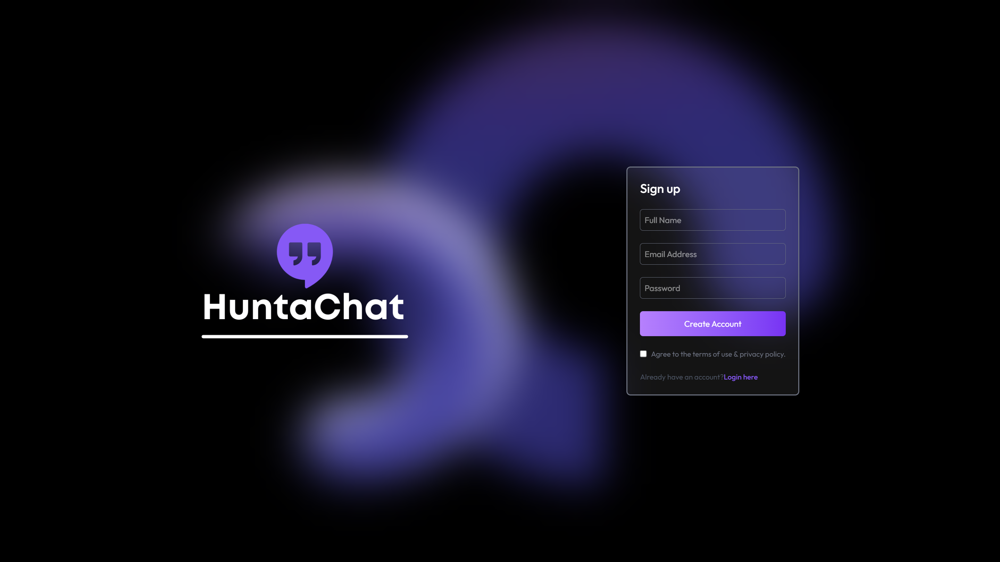
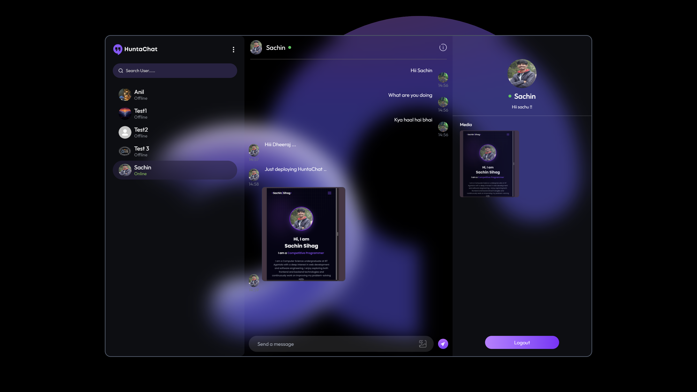
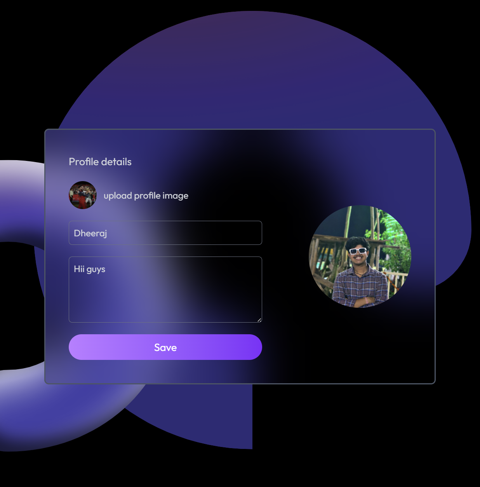

# HuntaChat

**HuntaChat is a full-stack real-time chat application built using the MERN stack (MongoDB, Express.js, React.js, Node.js) along with WebSockets for live messaging and Cloudinary for media storage. It features dedicated client and server modules, enabling seamless communication between users. The app is deployed on Vercel with a custom `vercel.json` configuration to connect frontend and backend.**


---

# Demo

* [**HuntaChat**](https://hunta-chat.vercel.app/) — https://hunta-chat.vercel.app/


# Features

* 🔐 **User Authentication** – Sign up, log in, and maintain sessions securely.
* 💬 **One-to-One Chat** – Private messaging between users.
* ⚡ **Real-Time Messaging** – Messages delivered instantly using WebSockets.
* 🟢 **Online/Offline Status** – See who’s currently active.
* 📸 **Media Sharing** – Send images inside chat.
* 🕒 **Message Timestamps** – Every message tagged with delivery time.
* 🙍 **User Profile Edit** – Update profile details, username, or avatar easily.
* 🔔 **Unseen Message Count** – Notifications for unread messages to never miss a chat.
* 📱 **Responsive UI** – Optimized for desktop and mobile devices.
* 🎨 **Clean Modern Design** – Minimal, easy-to-use interface.
* 🌐 **Vercel Deployment** – Hosted frontend & backend with custom `vercel.json` routing.
* 🔄 **Persistent Storage** – Chat history stored in database (no message loss).
* 🚀 **Scalable Architecture** – Separate client & server, deployable independently.


Perfect 🚀 Adding a **Tech Stack** section with badges makes the README look much more professional.
Here’s a ready-to-paste section:

---

## 🛠 Tech Stack

| Category            | Technologies |
|---------------------|--------------|
| **Language**        |  |
| **Frontend**        |   |
| **Backend**         |   |
| **Database & Storage** |   |
| **Real-Time**       |  |
| **Deployment**      |  |


---

# Screenshots
<table>
  <tr>
    <th>Login Page</th>
    <th>Chat Page</th>
    <th>Update Page</th>
  </tr>
  <tr>
    <td align="center">
      
    </td>
    <td align="center">
      
    </td>
    <td align="center">
      
    </td>
  </tr>
</table>

## 📂 Project Structure

```text
HuntaChat/
├── client/       # Frontend application
│   └── vercel.json  # Deployment configuration for frontend
├── server/       # Backend server
│   └── vercel.json  # Deployment configuration for backend
├── .gitignore    
└── README.md     
````

---

## 🚀 Getting Started (Local Development)

### Prerequisites

* [Node.js](https://nodejs.org/) (v14 or higher)
* [npm](https://www.npmjs.com/) or [Yarn](https://yarnpkg.com/)

### Installation

1. Clone the repository:

   ```bash
   git clone https://github.com/SachinSihag1407/HuntaChat.git
   cd HuntaChat
   ```

2. Install dependencies:

   ```bash
   cd client
   npm install
   cd ../server
   npm install
   ```

Got it ✅
Here’s a **README section** you can paste directly under **Setup** or **Getting Started**.

---

## ⚙️ Environment Variables

Before running the project, create a `.env` file in the **server** folder and add the following variables:

```env
MONGODB_URI = mongodb+srv://<username>:<password>@<cluster-url>/<database>
PORT = 5000
ACCESS_TOKEN_SECRET = your_secret_key_here

CLOUD_NAME = your_cloudinary_cloud_name
API_KEY = your_cloudinary_api_key
API_SECRET = your_cloudinary_api_secret
```


## ▶️ Running Locally

Open two terminals:

* **Terminal 1** – Start backend:

  ```bash
  cd server
  npm run dev
  ```

* **Terminal 2** – Start frontend:

  ```bash
  cd client
  npm run dev
  ```

---

## 🌐 Deployment on Vercel

This project is deployed on **Vercel** with separate configs for **server** and **client**.

### Backend (`server/vercel.json`)

```json
{
  "version": 2,
  "builds": [
    {
      "src": "server.js",
      "use": "@vercel/node",
      "config": {
        "includeFiles": [
          "dist/**"
        ]
      }
    }
  ],
  "routes": [
    {
      "src": "/(.*)",
      "dest": "server.js"
    }
  ]
}
```

### Frontend (`client/vercel.json`)

```json
{
  "rewrites": [
    {
      "source": "/(.*)",
      "destination": "/"
    }
  ]
}
```

✅ This configuration allows **frontend requests** to be routed correctly while also connecting with the **backend** hosted on Vercel.

---

## 🤝 Contributing

We welcome contributions from everyone! 🎉  

Here’s how you can contribute:  

1. 🍴 **Fork** this repository  
2. 🌱 Create a new branch → `git checkout -b feature/AmazingFeature`  
3. 💾 **Commit** your changes → `git commit -m "Add AmazingFeature"`  
4. 🚀 **Push** to your branch → `git push origin feature/AmazingFeature`  
5. 🔁 Open a **Pull Request**  

> ✨ Pro tip: Small improvements (typos, docs, styling) are just as valuable as big features!  

---

## 🙌 Acknowledgments

A huge shout-out to the awesome people behind this project:  

👨‍💻 [**Sachin Sihag**](https://github.com/SachinSihag1407)  
👨‍💻 [**Dheeraj Kumar**](https://github.com/dheerajsharrma)  

🚀 Powered & deployed with ❤️ using [**Vercel**](https://vercel.com/)  

---

🔥 **HuntaChat** — Real-time conversations made **simple, fast & fun**!  

